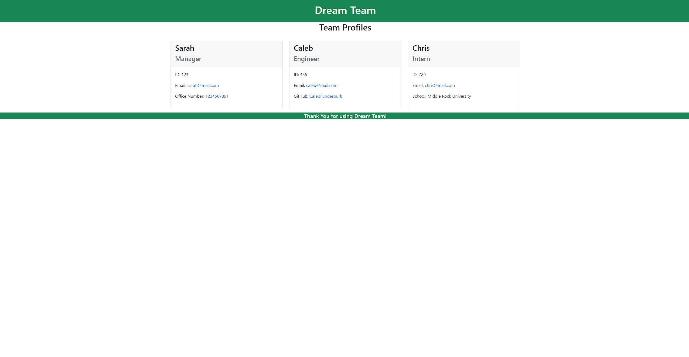

# Dream Team

## About this App

### Description 

Dream Team is a command line application that accepts user input in order to generate a responsive HTML file for a team of workers.

### User Story

As a business manager looking for a way to make a webpage for my team, I would like an application that accepts my user input to generate a sleek HTML file. When I run the application, I am presented with a series of prompts that ask me for information regarding the team I am working with. Once the prompts have been answered, I can view my generated HTML file in the dist folder of my project.

### Features

1. This HTML file displays profiles with employee information that the manager enters themselves.
2. The information displayed varies for each type of employee you can create.
3. Users will also be able to click on different elements of the employees portflio in order to be taken to those external links (E.g.: if you click on the Engineer's GitHub username, a new tab will open taking you to their profile.)

## Installation

In order to run this program you will need to:

* Clone this repository to receive all the files.

## Requirments

- Code editor (Visual Studio Code is reccomended)
- Command line terminal (GitBash, PowerShell, Terminal, etc.)
- Most recent version of Node.JS
- Node packages used in the project
- Clone the Dream Team project file onto your machine

## How to use

After gathering the necessary tools mentioned above, open the Dream Team project folder in your code editor. At this time, open your command line and navigate to the root directory for Dream Team. Once you are in the root directory run the following command in your command line: node index.js. This command will begin a series of prompts. Once you have answered all of the prompts, your HTML file will be generated and stored in the "dist" folder located in the root directory for Dream Team.
 
 
Please refer to this video for additional help on getting started:

<a href="https://www.youtube.com/watch?v=cWODETuIn2M" target="_blank">Demonstration Video</a>

## Screenshot of sample:

## Contributions

Caleb Funderburk
